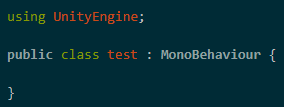
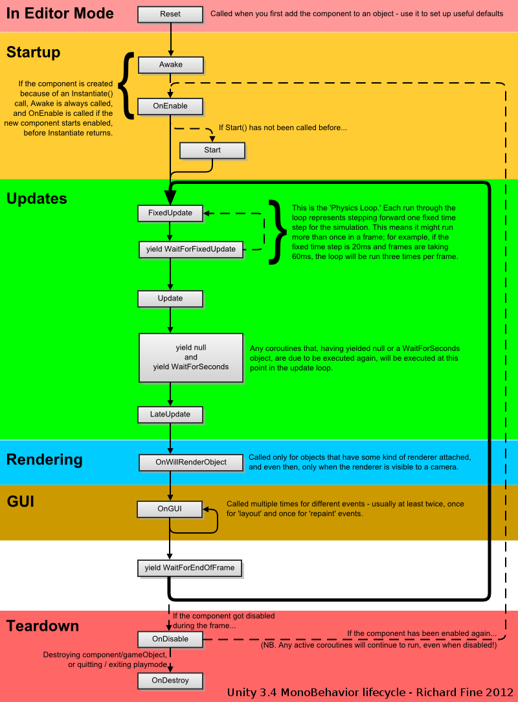

### 輸入mono可叫出初始介面如下:  
    

### Unity LifeCycle
  

### [C#補充教材](https://www.runoob.com/csharp/csharp-tutorial.html)  

### RAM記憶體存放空間概念  
> 1. Global: Global variable、Static Global  
    - 程式效率高但沒有存活週期，占用記憶體到結束
> 2. Stack: Local variable、function、method  
    - lifetime結束後自動回收記憶體  
    - 宣告後直接指向變數，處理速度快  
    - struct(預設public)&enum: Value Types
> 3. Heap: Reference type  
    - 創建時才配置記憶體，複製參考位置->無法預測執行方式  
    - 執行完有可能依舊存放在Heap，需自行控制記憶體回收  
    - 優化時需考慮進去  
    - class(預設private)、dynamic、object、string

### Access Modifier
- Public
- Private
- Protected
- Internal
- Protected internal

NOTE TIME: 2-1 11:21
test for git name change...
